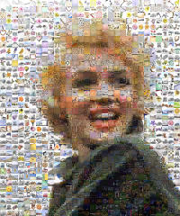

# photolib

[](https://travis-ci.org/arnehilmann/photolib)
[](https://coveralls.io/r/arnehilmann/photolib)


prepare for huge photo mosaics, searchable photo archive, and offline face-recognition

- import new photos, generate date-based hierarchy
```
...DCIM/101CANON/IMG_1234.JPG
    vvvv [transfer] vvvv
2015/
 +-- 2015-06/
      +-- 2015-06-29/
           +-- 2015-06-29T13-42.1234.JPG
```

- analyze photos and metainformation (faces detected by [picasa](http://picasa.google.com/))

    - generate smaller photos (aka tiles, 240x240px) for mosaic rendering

    - generate closeup of detected faces

- render mosaics using [metapixel](http://www.complang.tuwien.ac.at/schani/metapixel/)<br/>
  [](res/Marilyn_Monroe,_Korea,_1954_cropped.30.20.scaled.jpg)


## tl;dr

### install

download project, install prerequisites (ubuntu-specific)

```bash
git clone https://github.com/arnehilmann/photolib.git

cd photolib

bootstrap/ubuntu
```

### usage

```bash
source ve/bin/activate  # activate photolib

transfer-photos --source-dir <BUNCH_OF_NEW_PHOTOS> --photos-dir <MY_PHOTO_LIBRARY>

# picasa face detection in MY_PHOTO_LIBRARY happens here

generate-exifdata --photos-dir <MY_PHOTO_LIBRARY>

analyze-photos --photos-dir <MY_PHOTO_LIBRARY>... --faces-dir <FACES_LIBRARY> --tiles-dir <TILES_LIBRARY>

prepare-tiles --tiles-dir <TILES_LIBRARY>

render-mosaic --in <INPUT_FILE> --tiles-dir <TILES_LIBRARY> [options]
```


## Referenced Projects/Applications

- [python](http://www.python.org/)

- [virtualenv](http://www.virtualenv.org/en/latest/)

- [jhead](http://www.sentex.net/~mwandel/jhead/)

- [exiftool](http://www.sno.phy.queensu.ca/~phil/exiftool/)

- [imagemagick](http://www.imagemagick.org/)

- [metapixel](http://www.complang.tuwien.ac.at/schani/metapixel/)


## How to run picasa and its face recognition

- [virtualbox](https://www.virtualbox.org/) with official [windows os](http://dev.modern.ie/tools/vms/)

- mount your photos dir as additional drive in your vm

- install both [picasa](http://picasa.google.com/) and [picasastarter](https://sites.google.com/site/picasastartersite/)

- use picasastarter to configure/start picasa

- backup your Google-Folder often

- ~~not recommended any longer: [picasa3.9 on ubuntu using wine](picasa_on_ubuntu.md)~~


## How to use metapixel on MacOS

see the separate [HowTo](metapixel-on-macos.md)


## TODO

- ~~make analyze-photos idempotent~~ done

  - ~~let analyze-photos remove photos when face information changed~~

- add minimal exif data for photos without exif

- set mtime of photos to its exif timestamp

